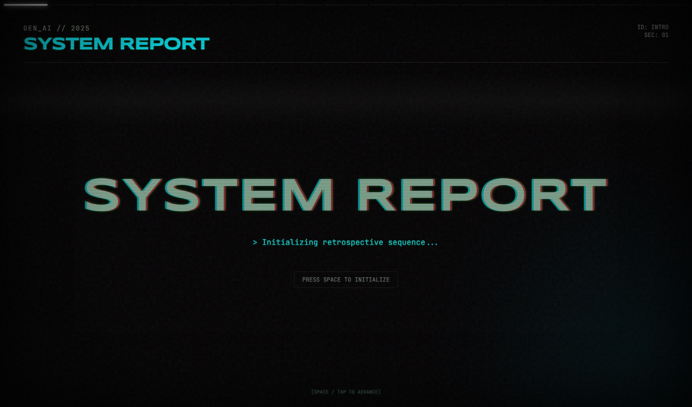

# GenAI Wrapped 2025

An interactive data storytelling experience on the GenAI industry for 2025

---

## Getting Started

The entire experience is self-contained within `index.html`. Just launch it in your browser!

---

## Technical Details

This application was built as a collaboration between [`gemini-3.0-pro`](https://deepmind.google/models/gemini/pro/) and [`claude-sonnet-4.5`](https://www.anthropic.com/news/claude-sonnet-4-5), with Gemini providing the design aesthetics, and Claude providing the code foundations.

### Tech Stack
- **React**: Component-based UI with hooks for state management
- **Framer Motion**: GPU-accelerated animations and transitions
- **Babel Standalone**: Just-in-time JSX compilation in the browser
- **Tailwind CSS**: Utility-first styling with custom theme extension
- **Custom CSS**: CRT monitor effects (scan lines, vignette, noise, flicker animations)

### Key Features
- **Interactive Slides**: Data visualizations include growth charts, timelines, comparisons, stat grids, and scrollable summaries
- **Multiple Slide Types**: Title, growth_chart, timeline, comparison, big_number, alert, stat_grid, unicorn_list, warning_list, apple_summary_scroll
- **Keyboard Navigation**: Space/Arrow keys to navigate, S to view sources, ESC to close modals
- **Sources Panel**: Modal system displaying citations and references for each slide
- **Progress Indicator**: Visual progress bar showing current position
- **Responsive Design**: Mobile-friendly with adaptive typography and layouts
- **Terminal Aesthetics**: Neon color palette, glitch text effects, typewriter animations

---

## Design Inspiration

December is usually the time when initiatives such as [Spotify Wrapped](https://www.spotify.com/ph-en/wrapped/), [YouTube Recap](https://blog.youtube/news-and-events/youtube-recap-2025/), and [Discord Checkpoint](https://discord.com/blog/checkpoint-2025-discord-year-in-review) come out. This meant the idea to make something similar for the GenAI industry came naturally.

I was also curious about UI design prowess of the latest frontier LLMs. [`gemini-3.0-pro`](https://deepmind.google/models/gemini/pro/) stood out in particular to me as a lot of builders touted it as the current best model for design work.

Thus, I kept my actual prompt vague, and left majority of the heavy lifting to Gemini. However, I did include the prompt for Claude's [`frontend-design`](https://raw.githubusercontent.com/anthropics/claude-code/refs/heads/main/plugins/frontend-design/skills/frontend-design/SKILL.md) skill to steer Gemini away from typical AI design aesthetics.

The full app prompt is [available here.](prompts/app.md)

---

## Data Gathering

A data storytelling app wouldn't be complete without the data.

The research behind this experience is performed with a collaboration across [`o4-mini-deep-research`](https://platform.openai.com/docs/models/o4-mini-deep-research) and [`claude-4.5-sonnet`](https://www.anthropic.com/news/claude-sonnet-4-5), with Claude designing the deep research prompt and GPT generating the actual report.

I also wanted to see if LLMs would be capable of synthesizing insights from a really fast-moving industry, with most developments this year being outside their training data.

The deep research prompt is [available here](prompts/research_prompt.md), and the generated report is [available here](prompts/report.md).

---

## Overall Thoughts

Summing everything up, I'm happy with how things turned out with only one night's worth of work. While I had to apply some guidance and curation to help the LLMs along, overall, they did a lot more heavy lifing than I did.

I'm excited to see how this will look next year!
